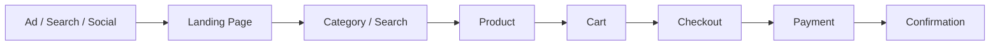

# Audit Method

## 1. Define the business goal

Before reviewing pages, clarify the desired action:

- completed online order
- WhatsApp inquiry
- quotation request
- booking
- lead form
- store visit

A page cannot be judged properly without knowing what it should help the user do.

## 2. Map the journey

Document the main customer path:

Also map alternate paths:

- direct product link
- WhatsApp inquiry
- failed payment
- out-of-stock product
- custom-order request
- pre-order flow

## 3. Review using four lenses

### Clarity

Does the customer understand the offer, price, delivery, and next step?

### Friction

What extra effort is required?

### Trust

What uncertainty or perceived risk remains?

### Motivation

Does the page explain why the product or offer matters?

## 4. Collect evidence

Use:

- page screenshots
- mobile recordings
- analytics
- search terms
- support questions
- failed-payment records
- checkout errors
- customer messages
- usability observations

Do not state assumptions as facts.

## 5. Score each section

Score individual checks, then calculate the category result.

## 6. Prioritise

Avoid handing the client a long undifferentiated problem list.

Separate findings into:

- Critical
- High
- Medium
- Low

## 7. Turn findings into actions

Every finding should contain:

- problem
- evidence
- customer impact
- recommendation
- owner
- effort
- priority
- success measure
